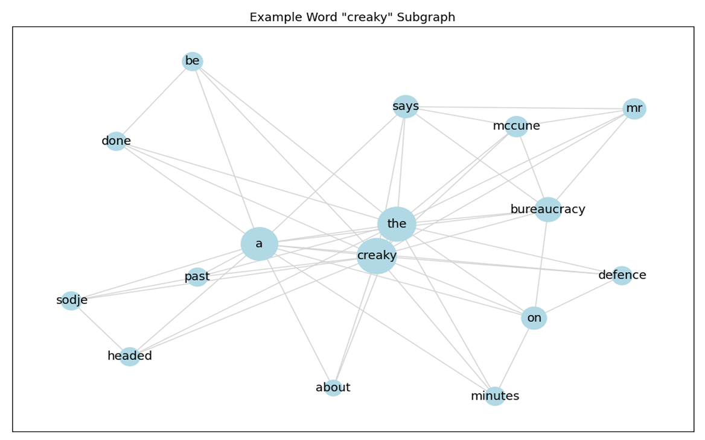

<h1>TGNLP:<br>A Three-Graph Natural Language Processing Library</h1>

<h2>Authors:<br>
Jesse Coulson: <a href="https://www.linkedin.com/in/jessecoulson/">Linkedin</a>, <a href="https://github.com/jccoulson">Github</a><br>
Primrose Johns: <a href="https://www.linkedin.com/in/primrose-johns-4b957b15a/">Linkedin</a>, <a href="https://github.com/Primrose-Johns">Github</a></h2><br>

<!-- START OF INTRODUCTION -->
<h2>Introduction</h2>
This project allows users to create graphs that represent multiple kinds of word relationships in a provided corpus in Python3. Outputs are NetworkX graphs, allowing the user to use their powerful library to further investigate graph output. We also provide some functions of our own that produce subgraphs and metrics that tell the user more about a particular graph.<br>
Our work was originally inspired by <a href="https://github.com/THUMLP/TensorGCN">TensorGCN</a>.

<!-- START OF QUICK-START GUIDE -->
<h2>Quick Start Guide</h2>
<h3>Making a Corpus</h3>

To start, you'll need to build a `Corpus()` object, which is what all graph generators take as input. The Corpus can be built from a Pandas Series of strings, a list of strings, or just one large string.

```python
import TGNLP as tgnlp

#data could be a pd.Series, a list, or one large string
corpus = tgnlp.Corpus(data)
```
Corpuses are never modified by any functions that use them, so the same Corpus object can be reused to create as many graphs as are needed.

<h3>Generating a Graph</h3>

Once you have a Corpus object, you can use it to generate the graphs we have implemented using `get_sequential_graph()`, `get_semantic_graph()`, and `get_syntactic_graph()`. The output is a weighted, undirected NetworkX graph.

```python
G = tgnlp.get_sequential_graph(corpus)
print(type(G))
```
Output:
```text
<class 'networkx.classes.graph.Graph'>
```
<h3>Graph Processing</h3>

You can also trim the graph down, using `trim_norm_graph()`.<br>
```python
tgnlp.trim_norm_graph(G, inplace=True)
```
This is done by trimming a percentage of the total edgeweight and <i>not</i> by trimming a certain percentage of all edges. This means that the trimming process may remove far more than 10% of the edges if a large portion of graph edges have very small weights. We reccomend trimming at least 10% of edges by weight on all graphs, which is what `trim_norm_graph()` does by default. By default the trimming is done on a copy of the provided graph, but you can use `inplace=True` to avoid the extra memory usage that entails.

<h3>Graph Analysis</h3>

You can get a PDF report summarizing some of the important metrics about your corpus using `generate_graph_report()`, with your graph as input. It will appear in the directory the script is called from with the name `tgnlp_report.pdf`.
```python
#This will show up in the directory the python script is called from 
tgnlp.generate_graph_report(G)
```
The report is a two pages long, here's an example of one of our word subgraphs<br>
<p align="center">

</p>
The report also features visualizations of linear and logarithmic degree distributions, as well as overall graph metrics like average degree, and specific details on the highest- and lowest-degree nodes in the graph.<br><br><br><br>

<!-- START OF DOCUMENTATION -->

<h1>Documentation</h1>

<!-- CORPUS CLASS -->
<h2>The Corpus Class</h2>

```python
Corpus(data)
```

<h4>Parameters</h4>

- **data**: *Pandas series, list, or string*<br>
The data to be parsed. Lists or series passed in must contain only strings

<h4>Returns</h4>

- **corpus**: *TGNLP Corpus object*<br>
A corpus representing the data parsed, which can be used for graph generation<br>

<h4>Attributes</h4>

- **sentence_corpus**: *List of strings*<br>
Every Sentence in the corpus in order of appearance. Each sentence is an item in the list. All punctuation and whitespace has been removed.
- **word_corpus**: *List of strings*<br>
Every word in the collective corpus in order of appearance. Each word is an item in the list. All punctuation and whitespace has been removed.
- **word_counts**: *Dict of string:int*<br>
Every word in the corpus is a key in the dict. Values are the number of appearances that word makes over the whole corpus.

This is the object that all graph generation functions take as input. It stores a word corpus, a sentence corpus, and a word frequency dictionary. Corpus objects are never modified or altered by any TGNLP functions after they are created, so they can be reused to create multiple graphs as needed. The word and sentence corpuses are both generated by `data_to_corpus()`.<br><br><br><br>

<h2>The Three Graphs</h2>
TGNLP has three different graphs that it can generate, each of which represents different kinds of word relationships. All of the graphs are undirected, weighted graphs where nodes are represented by words and edges represent relationships between words. The weight of an edge represents how strong that relationship is, although what "strong" means depends on what graph is being worked with. There is the sequential graph, the semantic graph, and the syntactic graph.<br>These graphs were originally inspired by a methodology proposed by Xien Liu et al., and one implementation of their approach can be found in their <a href="https://github.com/THUMLP/TensorGCN">TensorGCN Github</a>.<br><br><br><br>

<!-- SEQUENTIAL GRAPH -->

<h2>The Sequential Graph</h2>

```python
get_sequential_graph(corpus, window_size=5)
```
<h4>Parameters</h4>

- **corpus**: *TGNLP Corpus*<br>
A corpus generated from the data to be analyzed
- **window_size**: *int, default=5*<br>
The size of the sliding window to be used
<h4>Returns</h4>

- **G**: *NetworkX Graph*<br>
A graph representing sequential relationships between words in the corpus

Nodes in the sequential graph represent individual words in the corpus. The weighted edges in the sequential graph represent how frequently two words appear near one another. This "nearness" is observed using a sliding window approach that the user can specify the size of. Every time two words appear in the same window, that counts towards the weight of their edge. In an untrimmed graph every pair of words that appear together in a window will have an edge. The edge weight is calculated as $W_{i,j} = \frac{freq_{i,j}}{min\\{freq_{i}, freq_{j}\\}}$, where $freq_{i,j}$ is the number of co-occurences of two words in the same window and $min\\{freq_{i}, freq_{j}\\}$ is the frequency of the less frequent word.